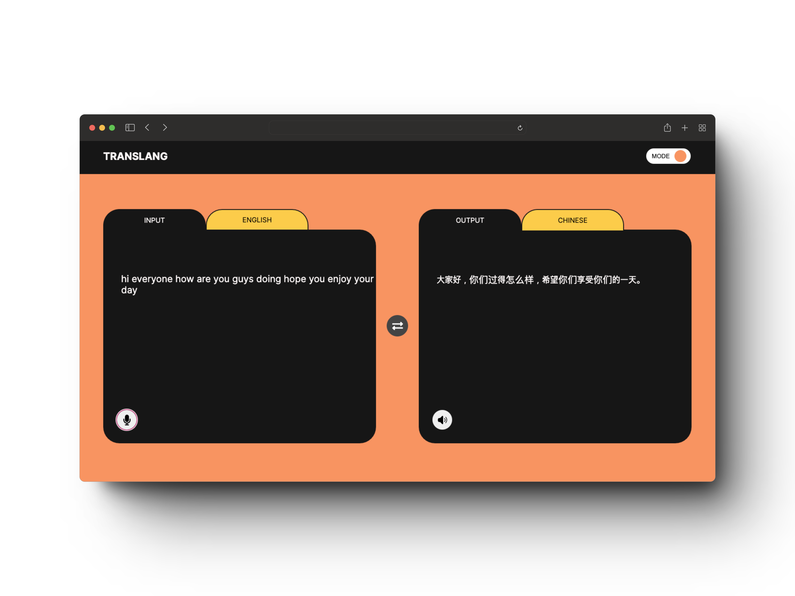
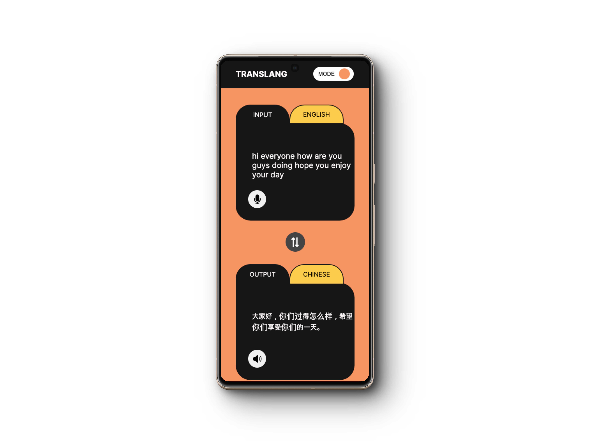

# Translang

> Project Description

A translate application which recognize user's voice and translate it to assigned languages. The output speaks out in the native language voice.

> Key Features

- Recognizing the user's voice using the SpeechRecognition API.
- Sending the transcription to the OpenAI API to translate the text into the assigned language(changeable).
- Retrieving the results in the translated language.
- Finding a voice suitable for the language speaker and setting it.
- Speaking the translated text using the chosen voice.
- A toggle for color mode.

> Tools

Next.js, TypeScript

> Project Mockups

[Project URL](https://translang-two.vercel.app/)

